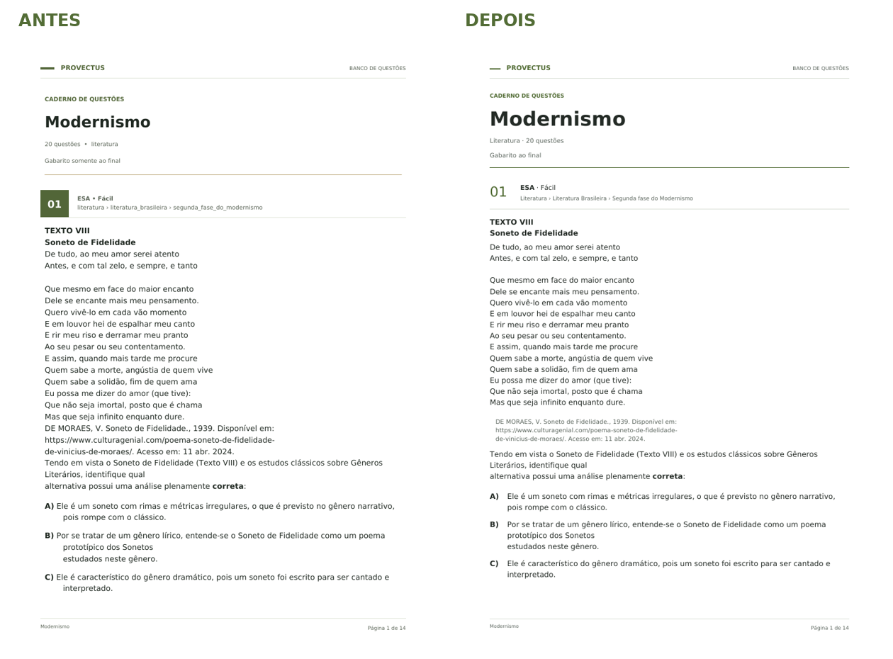
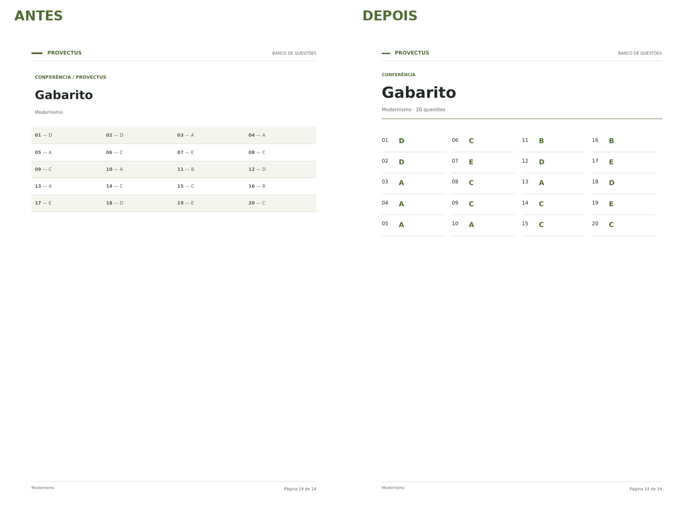

# Exportação editorial do Banco de Questões

Implementação concluída em 7 de outubro de 2026. A alteração está concentrada no PDF; o endpoint, o modal de exportação, os dados acadêmicos e as demais telas mantêm seus contratos.

## Antes e depois

| Elemento | Antes oficial | Depois |
| --- | --- | --- |
| Página | A4 branco | A4 branco, mantido |
| Abertura | Título e informações com hierarquia simples | Título com presença editorial e informações compactas |
| Questão | Número branco em quadrado verde | Número leve, banca e dificuldade textuais, linha fina |
| Conteúdo | Identificadores em `snake_case` | Humanização apenas na apresentação, sem alterações persistidas |
| Alternativas | Primeira linha junto à letra; continuação recuada | Letra em coluna própria; todas as linhas do texto alinhadas |
| Fontes | Mesmo peso do texto principal | Texto menor, neutro e discretamente recuado; URLs podem quebrar |
| Paginação | Questões pequenas e opções separadas | Grupos curtos ficam juntos; textos extensos continuam com indicador |
| Alternativa gráfica | Letra podia ficar antes da quebra e imagem depois | Letra permanece com sua figura; proporção e área útil preservadas |
| Gabarito final | Linhas alternadas com respostas pequenas | Colunas sequenciais, resposta em destaque, sem fundos coloridos |
| Leitura do gabarito | Ordem das linhas da grade | Desenho por coluna mantém ordem de leitura 01, 02, 03… no texto do PDF |
| Modernismo | 14 páginas; 75.907 bytes | 14 páginas; tamanho semelhante, informado em `qa-results.json` |





## Direção e implementação

Uma coluna de leitura, margens laterais de aproximadamente 17,6 mm, corpo de 10,2 pt e entrelinha de 15,3 pt. O verde impresso mantém o matiz oliva do frontend, com luminosidade ajustada para contraste sobre branco. A tipografia DejaVu já disponível no container permanece incorporada ao PDF. Não foram introduzidas fontes externas, imagens decorativas ou outra biblioteca de geração.

`PrintTheme` centraliza cores, margens, ritmo vertical e limites de agrupamento. `ContentRenderer` conserva rich-content, imagens inline e em bloco, sobrescritos, subscritos, negritos e quebras explícitas. A detecção conservadora de títulos em negrito e fontes bibliográficas altera apenas seu tratamento tipográfico. Textos e poemas não são reescritos nem remontados para eliminar as quebras originais.

O gabarito final adapta a quantidade de colunas, permite mais páginas quando necessário e mantém ordem sequencial na extração de texto. O gabarito após cada questão continua disponível. Não havia opção sem gabarito no contrato atual; nenhuma opção existente foi removida.

## Arquivos principais

- `api/app/question_pdf.py`: estilos, composição, agrupamentos, imagens e gabarito.
- `api/tests/test_question_pdf.py`: conteúdo, ordem, respostas, escaping, humanização, imagens, paginação e casos extensos.
- `api/tests/test_question_bank_contract.py`: verificação do endpoint com o novo desenho do gabarito.
- `api/tests/fixtures/pdf_modernismo.json`: dados reconstituídos do PDF oficial fornecido nesta tarefa.
- `api/scripts/generate_pdf_review.py`: reprodução dos três exemplos, incluindo casos visuais sintéticos.
- `README.md` e esta pasta: documentação, comparação e evidências.

## Validação

- 100 testes do backend passaram.
- 65 testes do frontend passaram; build de produção aprovado.
- Mesmas 20 questões, na mesma ordem; mesmas 99 alternativas e mesmos 20 gabaritos.
- Comparação direta entre os PDFs: os 14.212 caracteres acadêmicos são idênticos nos dois modos, ignorando apenas espaços e quebras de linha para a comparação.
- A comparação não ignora letras, pontuação, símbolos ou capitalização acadêmica. Os metadados humanizados são verificados separadamente.
- A4, fundo branco e limites da área útil verificados nas 33 páginas dos três PDFs de exemplo.
- Inspeção geométrica sem texto sobreposto, texto/imagem fora da área útil ou número de questão órfão.
- Renderização com Poppler e inspeção visual da abertura, páginas internas, poemas, questão longa, continuação, última página de questões e gabarito.
- Primeira página e gabarito também inspecionados em escala de cinza.
- Caso visual: fórmula inline, gráfico, quatro alternativas gráficas, 80 linhas de texto e URL extensa.
- Casos automatizados adicionais cobrem textos muito maiores, 160 respostas e imagens altas; figuras ausentes continuam impedindo a exportação com erro explícito.

Os logs estão nesta pasta; os resultados geométricos e tamanhos estão em `qa-results.json`. As verificações de paginação combinam testes de comportamento, geometria e inspeção das páginas renderizadas.

## Reproduzir

Com as dependências da API e as fontes DejaVu instaladas:

```bash
cd api
python scripts/generate_pdf_review.py
python -m pytest tests/test_question_pdf.py tests/test_question_bank_contract.py -q
```

Os exemplos serão escritos em `validacao_pdf/refatoracao/`. O script cria apenas os assets sintéticos necessários, sem consultar nem alterar o banco de produção.

## Limitações reais

O banco de produção não estava acessível. O exemplo Modernismo utiliza conteúdo recuperado do PDF enviado, com integridade comparada diretamente ao próprio PDF. O endpoint foi validado com o banco SQLite de teste, e os PDFs entregues foram gerados com ReportLab 4.4.4, a versão fixada no projeto. A instalação no container de produção e a integração com PostgreSQL não foram executadas neste ambiente.

Não há redução automática de letras, referências ou figuras para economizar páginas. Questões grandes e conjuntos gráficos que excedem uma página continuam em outras páginas. Isso evita cortes e mantém a qualidade de leitura.

## Atualizar a instalação

Use o projeto completo desta entrega, preserve seus arquivos `.env`, `.env.ingestion` e o diretório externo de imagens e execute o `atualizar.sh` já incluído no projeto. A refatoração do PDF não exige migração nova nem alteração dessas configurações.
